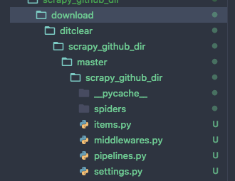

## Scrapy Github Dir
根据目录来爬取github仓库的文件




#### 运行

```bash
git clone https://github.com/ditclear/scrapy_github_dir.git
cd scrapy_github_dir
scrapy crawl app -a urls= GITHUB_DIR_PATH
```

#### 示例

```bash
scrapy crawl app -a urls=https://github.com/ditclear/MVVM-Android/tree/bfbbc4536e057f16bde923f8676c2befa6a47321/app/src/main/res/layout
```

多个路径以逗号`,`分隔

```bash
scrapy crawl app -a urls=https://github.com/ditclear/MVVM-Android/tree/bfbbc4536e057f16bde923f8676c2befa6a47321/app/src/main/res/layout,https://github.com/ditclear/MVVM-Android/tree/bfbbc4536e057f16bde923f8676c2befa6a47321/app/src/main/res/values
```


#### License

[MIT](LiCENSE)